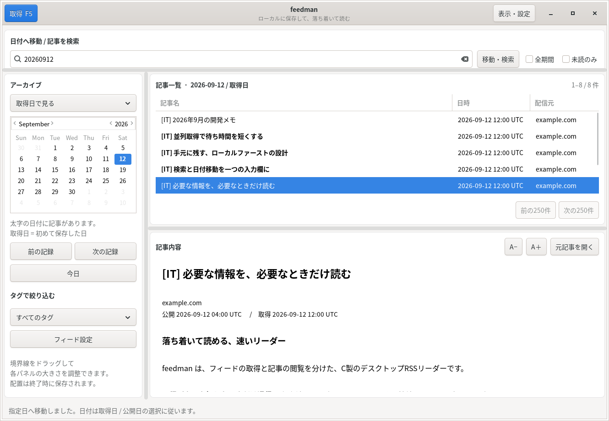

# feedman

**必要な情報を、必要なときだけ読む。** C17 / GTK 3 で書いた、ローカル保存型の RSS・Atom リーダーです。Linux（Debian / Ubuntu 系）を主な対象としています。



取得日カレンダー、タグ付き記事一覧、本文、日付・キーワード検索を一画面にまとめています。起動や閲覧だけではフィードを取得しません。通信するのは「取得」または `--fetch` を実行したときだけです。外部ブラウザーでリンクを開く場合は、ブラウザー側が通信します。

## ビルドと起動

Python、C++、WebKit、Electron は使用しません。ビルドには C コンパイラーと次の開発パッケージが必要です。

```sh
sudo apt update
sudo apt install build-essential cmake pkg-config \
  libgtk-3-dev libcurl4-openssl-dev libxml2-dev libsqlite3-dev libjson-c-dev

# このリポジトリのルートで実行
cp feeds.example.txt feeds.txt
cmake -S . -B build -DCMAKE_BUILD_TYPE=Release
cmake --build build --parallel
ctest --test-dir build --output-on-failure
./build/feedman
```

日本語フォントが入っていない環境では `sudo apt install fonts-noto-cjk`、GUI 自動テストも実行する場合は `sudo apt install xvfb xauth` を追加してください。デスクトップ環境で GTK のテーマが設定されていれば、それを利用します。

GUI を使わず、取得専用のバイナリーだけを作ることもできます。

```sh
cmake -S . -B build-headless -DFEEDMAN_GUI=OFF -DCMAKE_BUILD_TYPE=Release
cmake --build build-headless --parallel
./build-headless/feedman --fetch
```

この場合、`libgtk-3-dev` は不要です。Windows ネイティブ版と macOS 版は用意していません。公開パッケージはソース配布で、実行ファイルや依存ライブラリーは同梱していません。

## feeds.txt

1行に **`タグ URL`** を書きます。タグを省略した従来の URL だけの行も利用できます。

```text
# タグあり
IT https://www.techmeme.com/feed.xml
経済 https://www.cnbc.com/id/10000664/device/rss/rss.html

# タグなしの書式例（実在するフィードURLに置き換えてください）
# https://example.com/feed.xml
# - https://example.org/atom.xml
```

記事一覧では **`[IT] 記事タイトル`** のように、記事名の一番左にタグが付きます。タグなしの記事には空の `[]` を表示しません。タグは1つのフィードにつき1つで、空白を含めない文字列を指定します。半角空白またはタブで URL と区切ってください。

空行、`#` で始まるコメント、BOM、CRLF に対応します。完全に同じ URL・タグの重複行は1件にまとめます。同じ URL に異なるタグを指定した場合や、HTTP(S) 以外の URL、不正な行がある場合は、行番号を表示して処理を止めます。一部の設定を黙って無視する動作にはしていません。

画面の **「フィード設定」** でも編集できます。保存前に検証し、ファイルは一時ファイルから置き換えます。設定の保存・再読込では通信しません。タグを変更すると既存記事の表示にも反映されます。フィードを設定から削除しても、取得済みの記事は残します。タグ選択欄は現在の設定と旧データ用の `import` を表示し、削除済みフィードの記事は「すべてのタグ」で閲覧できます。

サンプルの配信元は利用者自身が選び直せます。配信 URL の継続性や接続成功、各サービスの利用条件は feedman が保証するものではありません。

## 画面の使い方

### 日付と検索

検索欄に **`20260912`** または **`2026-09-12`** を入れると、その日へ移動します。入力が止まって約180ミリ秒後に反映し、Enter または「移動・検索」なら即時に反映します。`20260230` のような存在しない日付では移動せず、エラーを表示します。

日付以外はタイトル・本文の部分一致検索です。カレンダーで選択した日が検索対象になり、「全期間」で保存済みの全期間を検索できます。タグと「未読のみ」も組み合わせられます。検索構文や正規表現ではなく、入力した文字列そのものを探します。8桁の数字を日付として扱うため、8桁の数値だけをキーワード検索する用途には対応していません。

カレンダーの太字は、その日に記事があることを示します。この印はタグ・検索語にかかわらず、その月の保存記事全体を基準にします。「前の記録」「次の記録」は記事のある日だけを移動します。

**取得日と公開日は別です。**

| 表示モード | 日付の意味 |
|---|---|
| 取得日で見る（標準） | feedman がその記事を初めて保存したローカル日付 |
| 公開日で見る | フィードに記載された公開日。日付なしは初回取得日 |

同じ記事を再取得しても初回取得日は変えません。取得履歴を毎日複製する方式ではありません。日付の分類は保存時のタイムゾーンで固定し、タイムゾーンを後から変更しても過去データを自動再分類しません。日時の表示には現在のローカルタイムゾーンを使います。

### レイアウトと閲覧

検索欄の下、カレンダーの右、記事一覧と本文の間の **境界線をマウスでドラッグ** できます。カレンダーと右側全体、記事一覧と本文の大きさをそれぞれ調整できます。画面の端までパネルを縮めた場合は、同じ境界線を戻すか「表示・設定」から配置をリセットしてください。

「表示・設定」では、一覧と本文の **上下配置 / 左右配置**、システム・明るい・暗いテーマ、並列取得数を変更できます。ウィンドウの大きさ、分割位置、配置、文字サイズ、テーマ、並列数、日付モードは終了時に保存します。

記事一覧は250件ずつ読み込みます。本文は選択した記事だけをデータベースから読み込み、表示した記事を既読にします。本文の `A−` / `A＋` で文字サイズを変更できます。

本文はフィードに含まれる内容を、見出し・段落・リスト・強調・リンクなどを保持して表示します。**元サイトの記事全文を自動取得する機能ではありません。** JavaScript や外部画像は読み込みません。複雑な表・CSS・埋め込み動画・ウェブページと同じレイアウトには対応せず、画像は代替テキストがあれば表示します。完全な表示が必要な記事は「元記事を開く」で外部ブラウザーに渡してください。

### キーボード

| キー | 操作 |
|---|---|
| `Ctrl+L` / `Ctrl+F` | 検索欄へ移動し、入力を選択 |
| `Enter` | 日付移動・検索を即時実行 |
| `F5` | フィードを取得 |
| `Esc` | 取得中の処理を停止 |
| `Alt+←` / `Alt+→` | 前 / 次の記事がある日 |
| `Ctrl++` / `Ctrl+-` / `Ctrl+0` | 本文を拡大 / 縮小 / 標準サイズ |
| `Ctrl+O` / 記事のダブルクリック | 元記事を外部ブラウザーで開く |
| `Ctrl+Q` | 終了 |

## 取得と高速化

標準は8スレッドで、1〜64スレッドの範囲で変更できます。実際のワーカー数はフィード数を超えません。ネットワーク通信と XML 解析をワーカーへ分離し、GUI のイベント処理は GTK のメインスレッドで行います。

各ワーカーは自分専用の libcurl ハンドルを再利用し、DNS と TLS セッション情報をロック付きで共有します。HTTP 圧縮、ETag / Last-Modified による条件付き取得にも対応します。サーバーが `304 Not Modified` を返した場合は本文転送・XML 再解析を省きます。HTTP キャッシュへの対応は配信元によって異なります。

保存は SQLite の WAL、日付索引、プリペアドステートメント、フィード単位のトランザクションを使用します。GUID / Atom ID、なければリンクを識別子にし、同一フィード内の重複保存を防ぎます。識別子もリンクもない場合はタイトルと元の日付文字列を使うため、その両方が変わると別記事になります。異なるフィード間の同一記事は、それぞれのタグと配信元を残すため統合しません。

SQLite が対応していれば FTS5 trigram 索引で3文字以上の検索を高速化します。2文字以下や未対応の SQLite では文字列走査に切り替えます。大量保存時の短い検索語は、日付・タグを併用してください。

ローカル模擬サーバーによる1回の測定では、16フィード・各応答150ms遅延・各20記事で、1スレッド **2.4166秒**、8スレッド **0.3111秒**（**7.77倍**）でした。どちらも320記事です。これは **C版内の1スレッド対8スレッド** の比較であり、元の Python 版やインターネット上の配信元との比較ではありません。詳しくは [検証記録](docs/VERIFICATION.md) を参照してください。

再現コマンド：

```sh
./build/feedman_tests --benchmark
```

`-DFEEDMAN_NATIVE=ON` は、その CPU に特化したビルドを明示的に選ぶオプションです。この設定で作った実行ファイルを別の CPU 向けに配布しないでください。通常の Release でも、対応コンパイラーでは LTO を利用します。

## CLI と保存先

```sh
./build/feedman --check-feeds
./build/feedman --feeds /path/to/feeds.txt --fetch --threads 16
./build/feedman --data-dir ./private-data --date 20260912
./build/feedman --published --date 20260912
./build/feedman --stats
./build/feedman --help
```

`--fetch` は GUI なしで1回取得し、結果を JSON で標準出力、進捗を標準エラー出力へ返します。成功は終了コード0、実行エラー1、一部フィード失敗2、キャンセル130です。成功したフィードは、他のフィードが失敗しても保存されます。自動リトライや定期取得は行いません。

設定ファイルは `--feeds` → カレントディレクトリーの `feeds.txt` → `$XDG_CONFIG_HOME/feedman/feeds.txt` の順で選びます。`XDG_CONFIG_HOME` が未設定なら `~/.config` を使用し、標準の設定がなければサンプルを作成します。明示指定した存在しないファイルは、自動作成せずエラーにします。

データは `--data-dir`、未指定なら `$XDG_DATA_HOME/feedman`、環境変数も未設定なら `~/.local/share/feedman` に保存します。データベースは `feedman.db`、表示設定は `ui.ini` です。フィードの取得・旧データ移行の同時実行は、データベースごとのロックで防ぎます。

バックアップは feedman と取得用 CLI を終了してからデータディレクトリーごとコピーしてください。WAL 動作中の `.db` だけをコピーしたり、稼働中に `-wal` / `-shm` を削除したりしないでください。保存先はローカルディスクを想定しており、ネットワークファイルシステム上のデータベースは対象外です。速度優先の `synchronous=NORMAL` を使うため、OS クラッシュ・停電時に直前の確定済み更新が失われる可能性があります。

## myrss からの移行

旧アプリの `data/YYYY/MM/DD/*.json` を読み込めます。旧データは変更・削除しません。

```sh
./build/feedman --import-myrss ../myrss/data
./build/feedman --published --date 20260912
```

移行できるのはタイトル、リンク、summary、公開日時です。旧形式にはフィード URL、確実な初回取得日時、タグがないため、リンク先ホストごとの移行元と `[import]` タグを付けます。公開日表示は旧 JSON の `date`、取得日表示は **移行した日** になります。実際の過去の取得日を推測して埋めることはしません。

同じ JSON を再移行しても、同じリンクを重複保存しません。ただし、移行記事と後から実フィード経由で取得した記事は、元の GUID・配信元が特定できないため別記事になることがあります。不正 JSON は件数・エラーを報告してスキップします。移行前のバックアップを残して確認してください。

## GitHub に公開する前に

`.gitignore` で `feeds.txt`、データベース、旧データ、ビルド生成物を除外しています。設定例だけを共有してください。ZIPには元プロジェクトの `.git`、購読履歴、保存記事、個人設定を含めていません。

```sh
git init
git add .
git status --short
# 差分に個人用 URL、認証情報、データベースがないことを確認してからコミット
```

MIT ライセンス、開発手順、セキュリティ方針、GitHub Actions のビルド・テスト設定を同梱しています。リポジトリー作成や GitHub への送信は自動実行しません。バージョン1.0.0の検証範囲と未検証箇所は [VERIFICATION.md](docs/VERIFICATION.md) に記載しています。

- [内部構成](docs/ARCHITECTURE.md)
- [開発・テスト](CONTRIBUTING.md)
- [セキュリティ](SECURITY.md)
- [変更履歴](CHANGELOG.md)
- [MIT License](LICENSE)
